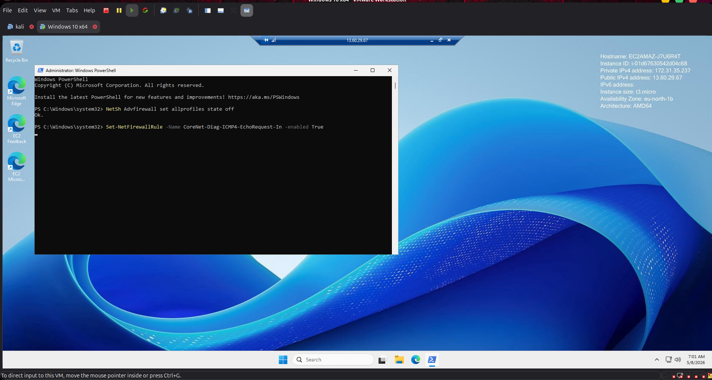
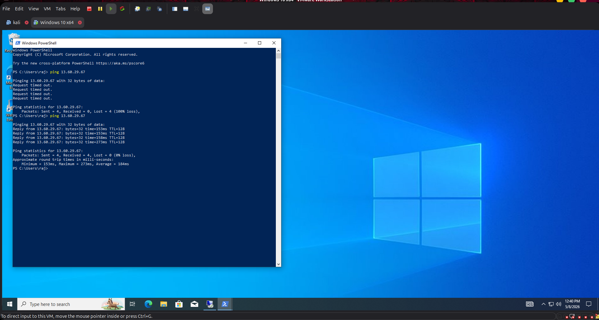
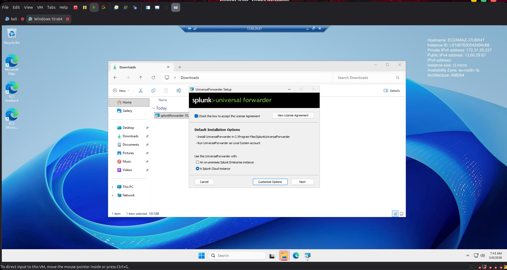
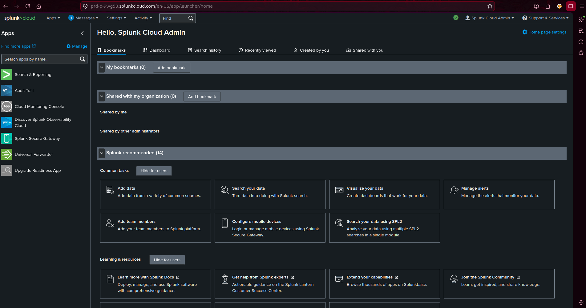
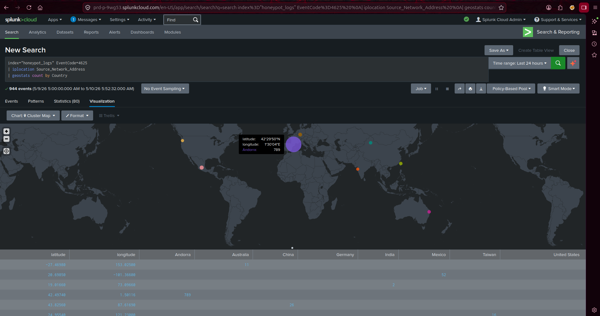
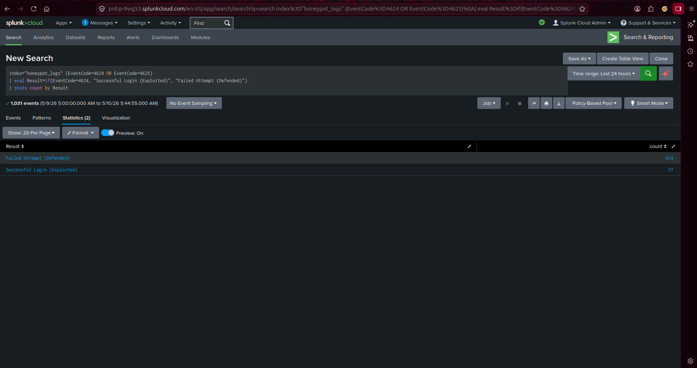
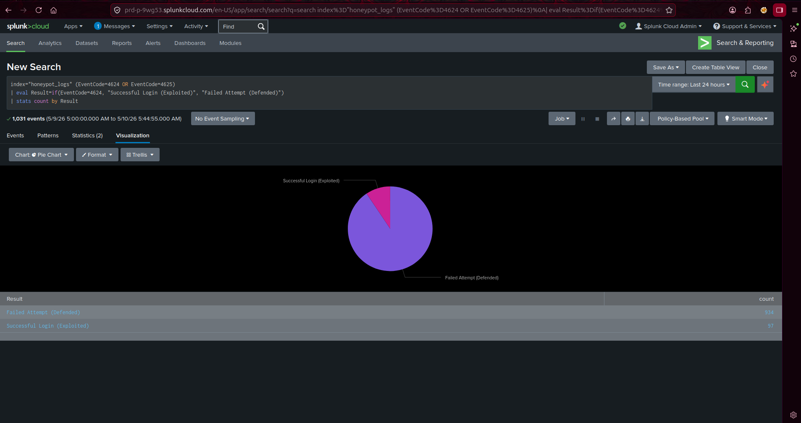
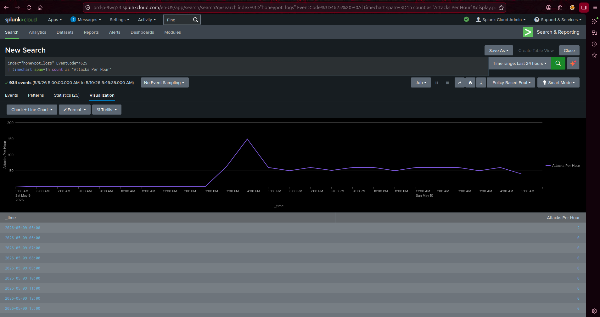
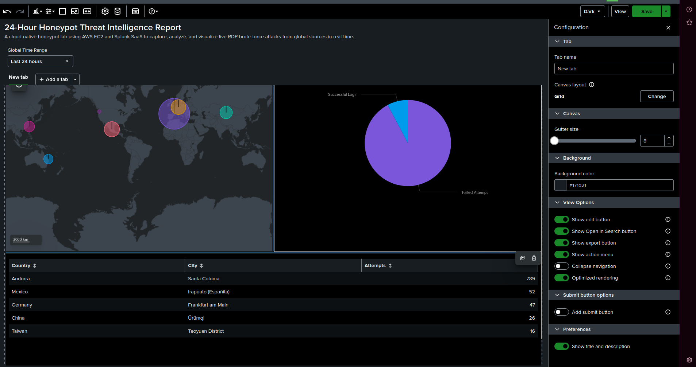

````md
# 🛡️ Cloud-Native SOC Analyst Lab: AWS Honeypot & Splunk Integration

## 📊 Project Overview

This project demonstrates the deployment of a cloud-based honeypot used to observe and analyze real-world brute-force attacks. By intentionally exposing a Windows Server 2025 instance to the internet, I captured live threat telemetry using the **Splunk Universal Forwarder** and visualized the data in **Splunk Cloud (SaaS)**.

### 🛠️ Core Technologies

* **Infrastructure:** AWS (EC2, VPC, Security Groups)
* **Target OS:** Windows Server 2025
* **SIEM:** Splunk Cloud (SaaS)
* **Data Transport:** Splunk Universal Forwarder (SSL Encrypted)
* **Analysis:** SPL (Splunk Processing Language), Geolocation Lookups

---

## 🏗️ Architecture & Data Flow

1. **Exposure:** A Windows VM was deployed in the AWS Stockholm region with Port 3389 (RDP) and ICMP (Ping) opened to the public internet.
2. **Collection:** The Splunk Universal Forwarder was installed on the VM to monitor the `Security` Event Log.
3. **Transmission:** Logs were securely forwarded to a Splunk Cloud instance using a custom credential package (.spl).
4. **Visualization:** Data was parsed to extract Attacker IPs, Geographic Coordinates, and Targeted Usernames.

---

# 📸 Evidence & Implementation

## 1. Environmental Setup

Configured AWS Security Groups and Windows Firewall to ensure the honeypot was discoverable by global scanners.

### AWS Interface


### AWS Instance


### Windows VM


### Windows Firewall Configuration


### ICMP / Ping Verification


---

## 2. Log Pipeline (Forwarder Installation)

Successfully linked the "Bait" (AWS VM) to the "Brain" (Splunk Cloud) by deploying the Universal Forwarder.

### Splunk Universal Forwarder Installation


---

## 3. Attack Telemetry Analysis

Over a 24-hour period, the system identified a massive volume of automated threats.

### Splunk Dashboard


### Geographic Attack Cluster Map


### Login Attempt Analysis


### Statistical Data


### Pie Chart Visualization


### Line Chart Visualization


### Splunk Report


---

# 📈 Key Findings (24-Hour Window)

* **Total Attack Events:** 1,031 events captured.
* **Total Failed Logins:** 934 attempts blocked by system security.
* **Top Attacking Countries:** Andorra (779), Mexico (52), Germany (47).
* **Most Targeted Account:** `Administrator`.
* **Mean Time to Discovery:** The honeypot was discovered and attacked within minutes of deployment.

---

# 🧹 Security & Cleanup

To maintain cloud hygiene and prevent unnecessary costs, the following steps were taken post-analysis:

* **Termination:** The AWS EC2 instance was fully terminated.
* **Volume Deletion:** All associated EBS volumes were removed.
* **Credential Revocation:** Splunk Cloud trial instances and forwarder credentials were decommissioned.

---

# 📜 Appendix: Sample SPL Queries Used

## Map Visualization

```spl
index="honeypot_logs" EventCode=4625 
| iplocation Source_Network_Address 
| geostats count by Country
````

## Success vs. Failure Comparison

```spl
index="honeypot_logs" (EventCode=4624 OR EventCode=4625)
| eval Result=if(EventCode=4624, "Successful Login", "Failed Attempt")
| stats count by Result
```

```
```
